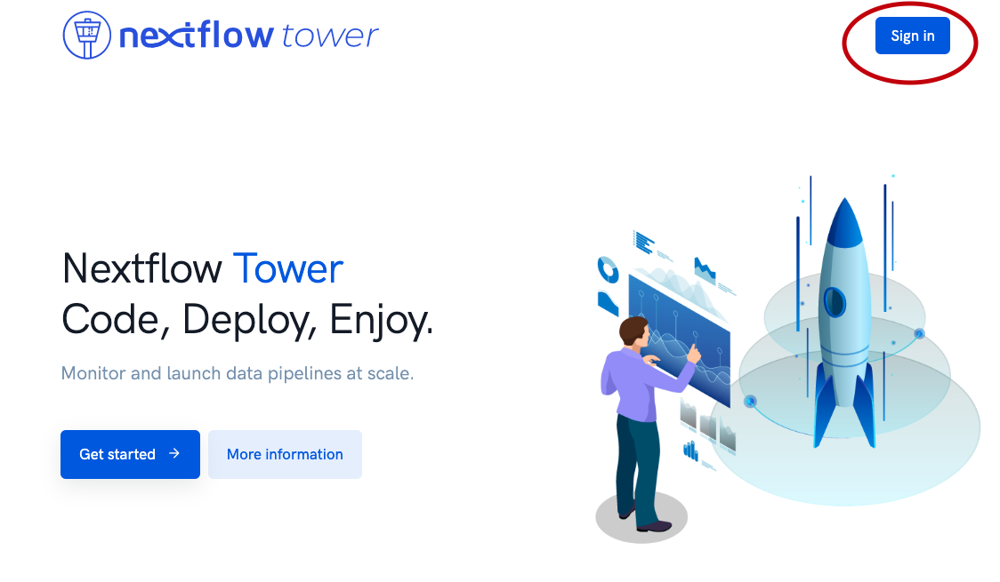
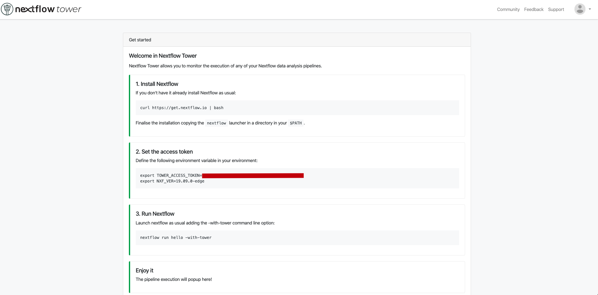
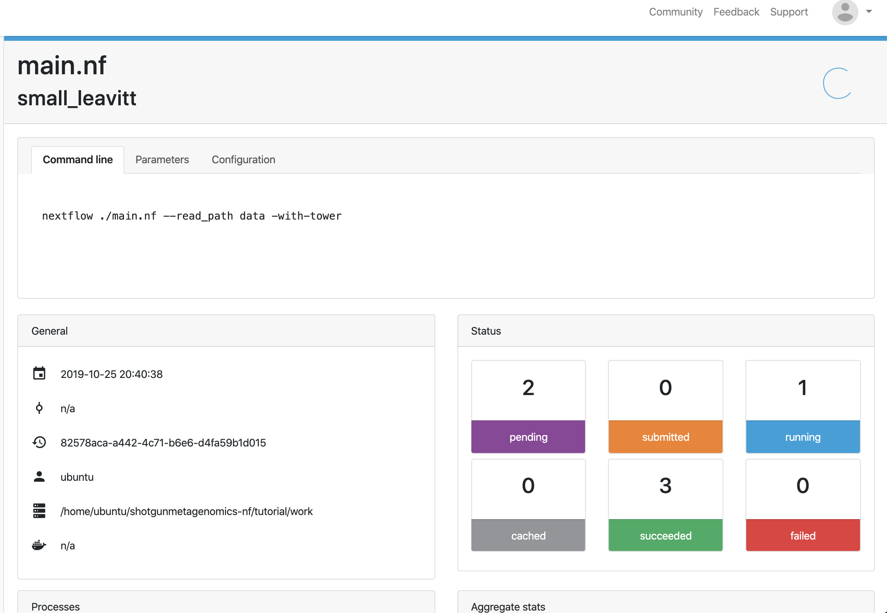
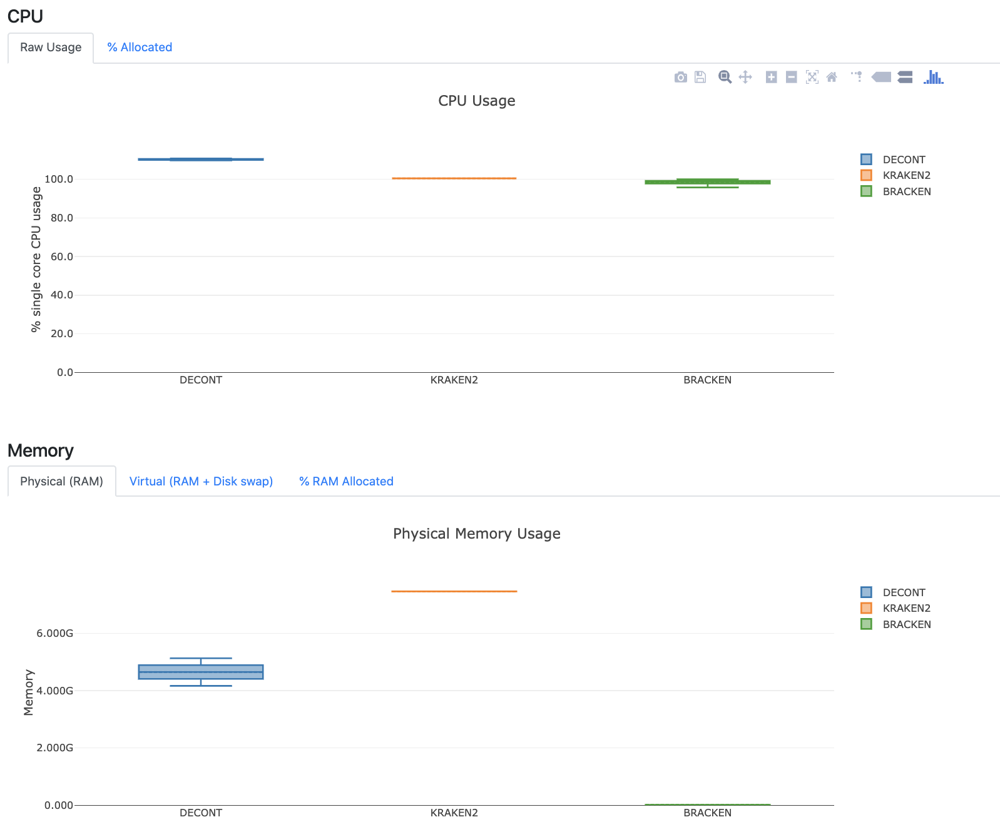

```{r setup, include=FALSE}

knitr::opts_chunk$set(echo = TRUE, eval=FALSE)
```

登录Nextflow Tower的[官方网站](tower.nf)

点击"Sign in"并输入邮箱，会在邮箱中收到登录链接



登陆后看到如下界面



在运行nextflow前设置环境变量

```sh
$ export TOWER_ACCESS_TOKEN=xxxxxxxxxxxxxxxxxxxxxxx
```

在运行上一篇的流程时，加入`-with-tower`参数

```sh
$ ./main.nf --read_path data -with-tower

N E X T F L O W  ~  version 19.09.0-edge
Launching `./main.nf` [angry_venter] - revision: 72dddbcd1f
WARN: DSL 2 IS AN EXPERIMENTAL FEATURE UNDER DEVELOPMENT -- SYNTAX MAY CHANGE IN FUTURE RELEASE
Monitor the execution with Nextflow Tower using this url https://tower.nf/watch/xxxxxx
executor >  local (8)

```

使用上面的链接或登录Nextflow Tower便可实时监控流程的运行



运行完成后可以查看流程使用资源的情况



(未完)
